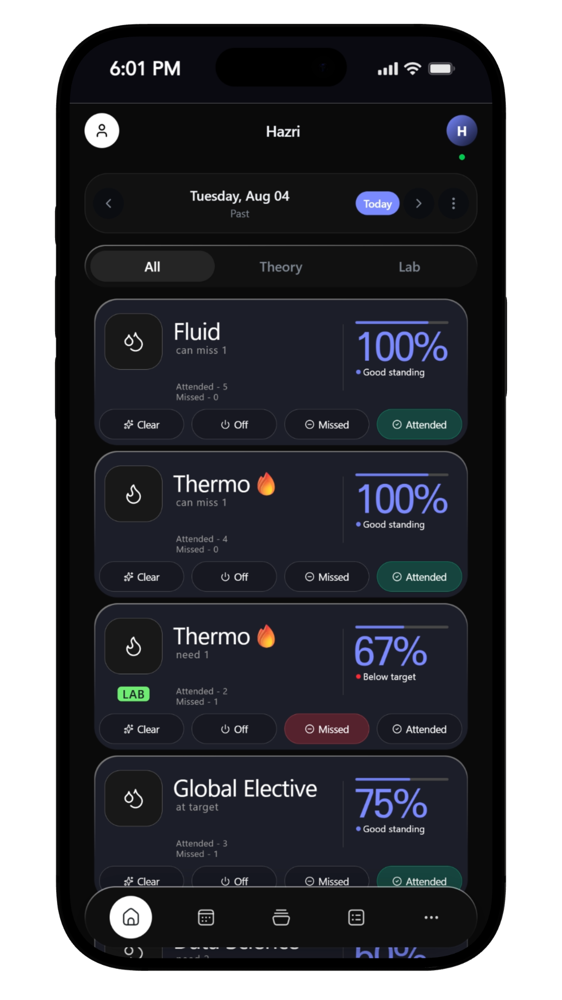
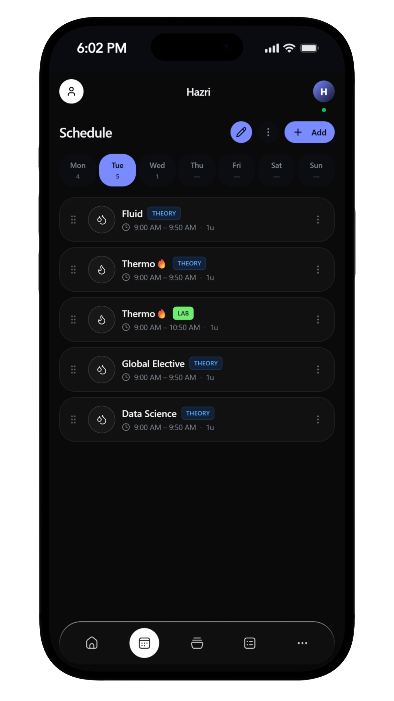
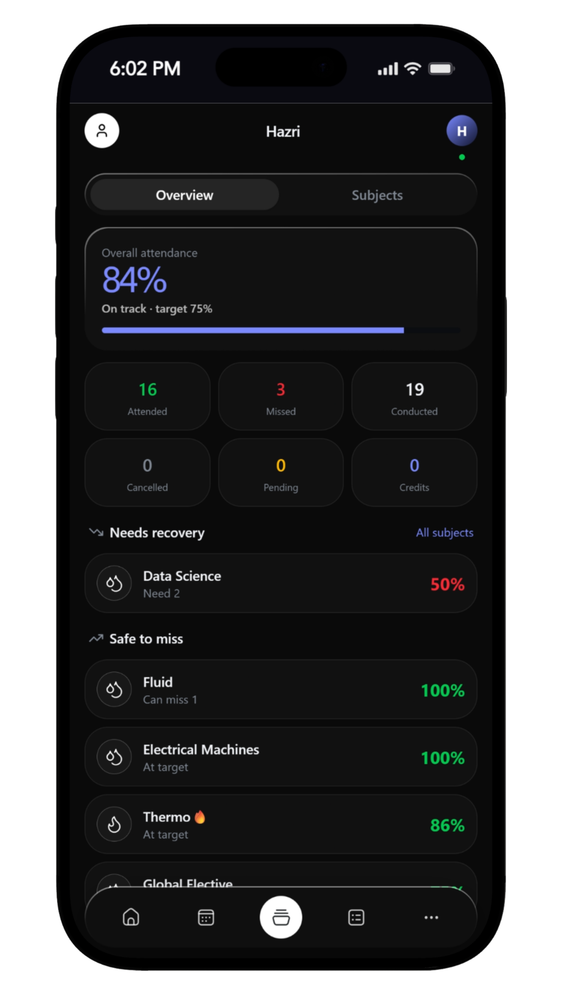
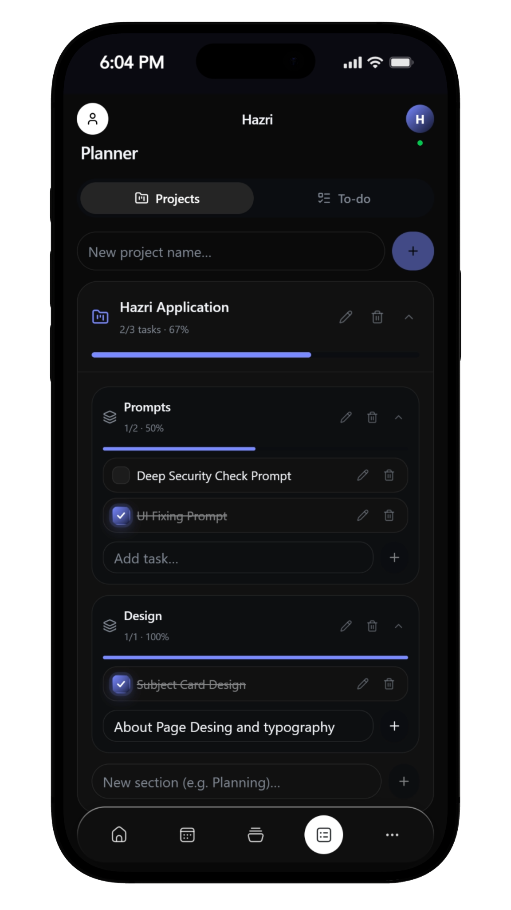
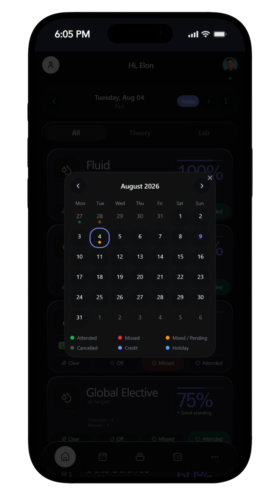

# Hazri

<p align="center">
  
</p>

<p align="center">
  A fast, privacy-focused attendance tracker for students.
</p>

<p align="center">
  <a href="https://github.com/Dipendra074/Hazri/releases">
    
  </a>
  
  
  
</p>

---

## Overview

Hazri is a lightweight attendance tracker designed for students who want a fast and simple way to manage subjects, schedules and attendance targets.

It is designed around quick daily usage, offline-first storage and minimal interaction.

---

## Features

- Quick attendance marking
- Subject-wise attendance tracking
- Attendance percentage and target tracking
- Theory, Lab and Tutorial support
- Timetable and schedule management
- Holiday management
- Course management
- Offline-first data storage
- Google Drive backup
- Android application
- Dark interface
- Attendance statistics
- First-time user guide

---

## Screenshots

<p align="center">
  
  &nbsp;&nbsp;
  
  &nbsp;&nbsp;
  
</p>

<p align="center">
  
  &nbsp;&nbsp;
  
</p>

---

## Download

Download the latest Android APK from:

### [Download Latest Hazri Release](https://github.com/Dipendra074/Hazri/releases/latest)

Previous versions are also available in the Releases section.

---

## Installation

1. Download the latest APK.
2. Open the downloaded file.
3. Allow installation from your browser or file manager if Android asks.
4. Install Hazri.
5. Open the app and complete the initial setup.

---

## Tech Stack

- React
- TypeScript
- Vite
- TanStack
- Capacitor
- Android
- IndexedDB
- Supabase
- Google Drive API

---

## Privacy

Hazri is designed to keep attendance data primarily on the user's device.

Google Drive backup is optional and requires user authorization.

No attendance data needs to be publicly stored for normal app usage.

---

## Project Structure

```text
Hazri/
├── android/
├── public/
├── scripts/
├── src/
├── supabase/
├── package.json
└── capacitor.config.ts
